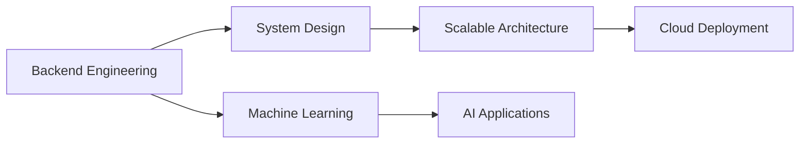

<div align="center">

# 👋 Hey, I'm Vijay Sai

### 🚀 Full-Stack Developer | 🧠 Backend & System Design Explorer | 🤖 AI/ML Learner | ⚙️ DevOps Enthusiast


[](https://www.linkedin.com/in/vijay-sai-kalivarapu/)
[](mailto:vijaysaikalivarapu@gmail.com)

</div>

---

# 🚀 About Me

> "Build systems that scale. Write code that lasts."

I am a hands-on developer passionate about building scalable backend systems and clean, efficient frontend applications.  
I enjoy understanding how real-world systems work — from API design and database modeling to CI/CD pipelines and deployment workflows.

🔹 Strong focus on backend engineering  
🔹 Interested in system design & scalable architecture  
🔹 Exploring AI & machine learning applications  
🔹 Actively learning DevOps & automation practices  
🔹 Believe in learning by building real projects  

---

# 🛠 Tech Ecosystem

<div align="center">

## 💻 Frontend Development


## ⚙️ Backend Development


## 🗄 Databases


## ⚙️ DevOps & Automation


</div>

---

# 📂 Featured Projects

## 🗂 Task Management System
```text
Tech Stack: Spring Boot • React • MySQL
Focus: Full-Stack Architecture & REST APIs
```

✔ RESTful API development  
✔ JWT-based authentication  
✔ CRUD operations with validation  
✔ Layered backend architecture  
✔ Responsive UI using React  
✔ Database schema design  

---

## 🤖 Object Detection & ML Experiments
```text
Tech Stack: Python • OpenCV • PyTorch
Focus: Computer Vision
```

✔ Selective Search implementation  
✔ HOG + SVM experiments  
✔ YOLO-based object detection  
✔ Dataset preprocessing & augmentation  
✔ Model evaluation & metrics  

---

## ⚙️ CI/CD Pipeline Practice
```text
Tech Stack: Docker • GitHub Actions
Focus: Automation & Deployment
```

✔ Containerized backend services  
✔ Automated build workflows  
✔ Continuous integration testing  
✔ Deployment-ready configurations  

---

# 🧠 System Design Interests

- API rate limiting strategies  
- Scalable backend architecture  
- Database indexing & optimization  
- Monolith vs Microservices comparison  
- Caching strategies  
- Authentication & security best practices  

---

# 📊 GitHub Analytics

<p align="center">
  
</p>

<p align="center">
  
</p>

<p align="center">
  
</p>

---

# 📈 Contribution Activity

<p align="center">
  
</p>

---

# 🏆 Certifications

- 🟢 NVIDIA – Fundamentals of Deep Learning  
- ⚡ AI & GPU Computing Basics  

---

# 📚 Continuous Learning Roadmap



---

# 💡 Development Philosophy

```javascript
const VijaySai = {
    role: "Full-Stack Developer",
    primaryFocus: "Backend & System Design",
    architectureStyle: "Clean & Scalable",
    devOpsMindset: "Automate Everything",
    aiInterest: "Applied Machine Learning",
    goal: "Build intelligent, scalable production-ready systems",
    motto: "Build. Optimize. Scale."
};
```

---

# 🎯 Current Focus

✔ Strengthening backend engineering skills  
✔ Improving system design thinking  
✔ Practicing CI/CD & containerization  
✔ Exploring applied AI in real-world projects  

---

# 🤝 Let’s Connect

- 💼 LinkedIn: https://www.linkedin.com/in/vijay-sai-kalivarapu/
- 📧 Email: vijaysaikalivarapu@gmail.com

---

<div align="center">

## ⭐ Build • Improve • Scale • Repeat


</div>
